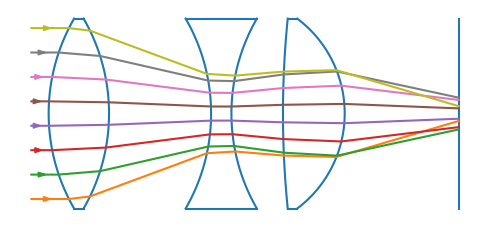

# geometrical-ray-tracing
 Python program that performs 2d geometrical ray tracing through a system of optical components such as mirrors and lenses. Tracing is implemented is C++ and makes no assumption about the order of interactions. It contains five basic components, namely:
 - Plane mirror
 - Planar boundary at which refraction occurs
 - A planar screen that absorbs rays
 - Mirror in the shape of a circular arc
 - Circular arc boundary at which refraction occurs

It also allows for so-called complex components such as lenses that are composed of pre-defined sub-components or other complex components. These can be defined within Python without needing to write any C++/Cython, so long as they are ultimately only composed of the five elements above or other complex components. 

## Build Instructions
The program runs under Python 3 and can be built by running `python setup.py build_ext`, adding the `--inplace` flag to install locally if desired. Cython and NumPy are required to build, the included examples may have additional dependencies (mainly Matplotlib).
